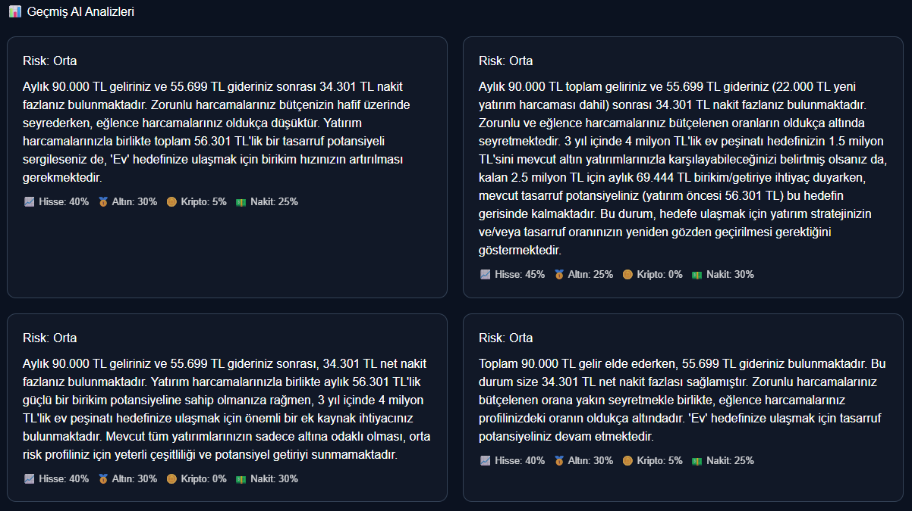
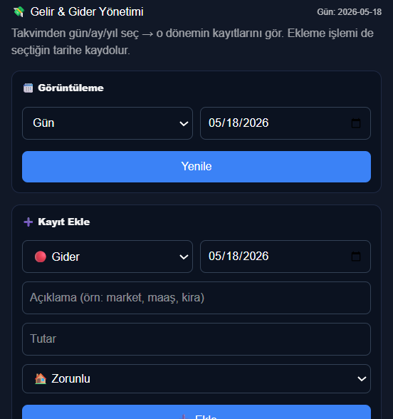
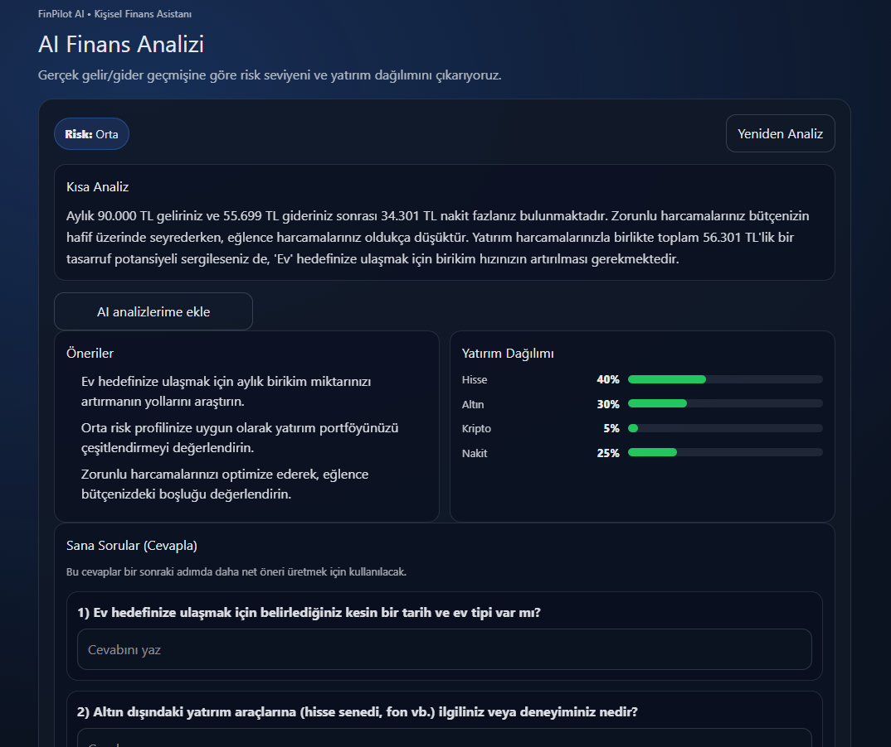

# 💰 FinPilot AI

Smart Financial Analyse AI, kullanıcıların gelir-gider verilerini analiz eden ve yapay zeka (Google Gemini) ile kişisel finans önerileri sunan modern bir web uygulamasıdır.

---

## 🚀 Proje Özeti

Bu uygulama, kullanıcıların finansal hareketlerini takip eder ve AI destekli analizler üreterek:

- Harcama alışkanlıklarını analiz eder
- Tasarruf oranını hesaplar
- Risk seviyesini belirler
- Kişisel finans önerileri sunar
- Geçmiş analizleri saklar

---

## 🧠 Yapay Zeka (AI) Özelliği

Google Gemini API kullanılarak:

- Gelir / gider dengesi analiz edilir
- Finansal risk seviyesi belirlenir (Düşük / Orta / Yüksek)
- 3 adet kişisel öneri oluşturulur
- Yatırım dağılımı hesaplanır
- Kullanıcıya 3 follow-up soru sorulur

---

## 📊 Özellikler

- Kullanıcı kayıt / giriş sistemi
- JWT tabanlı güvenli API
- Gelir & gider ekleme
- Dashboard üzerinde grafik analiz
- AI destekli finans yorumlama
- Geçmiş analizleri görüntüleme

## 📸 Ekran Görüntüleri

### 🏠 Dashboard

### 💸 Harcamalar

### 🧠 AI Analiz

### 📜 Geçmiş Analizler

